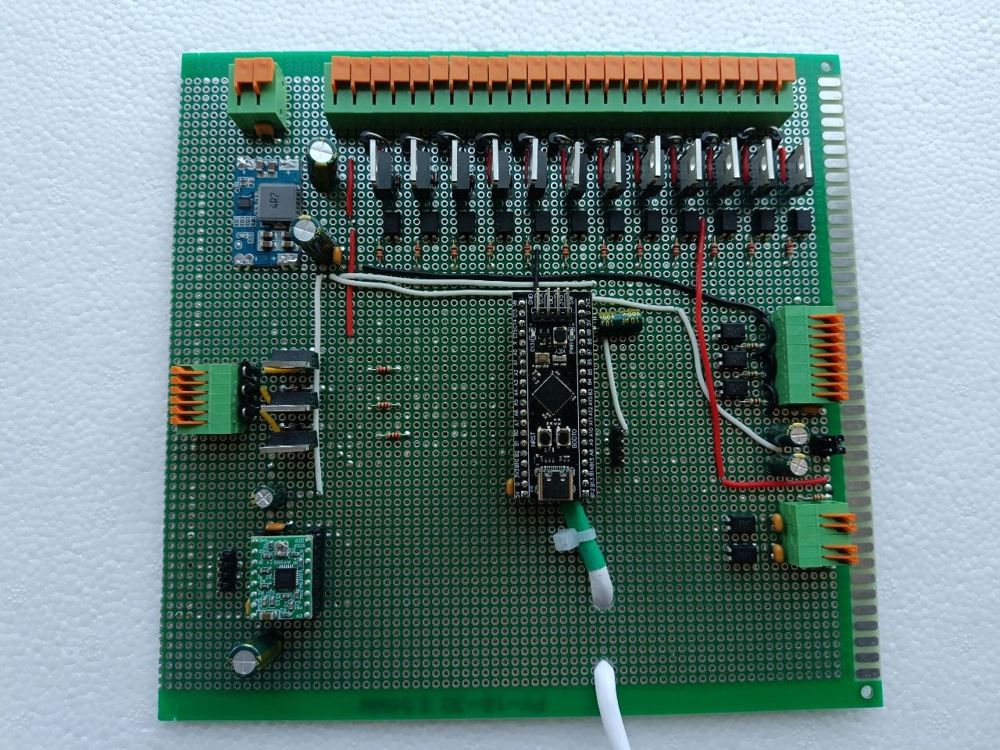
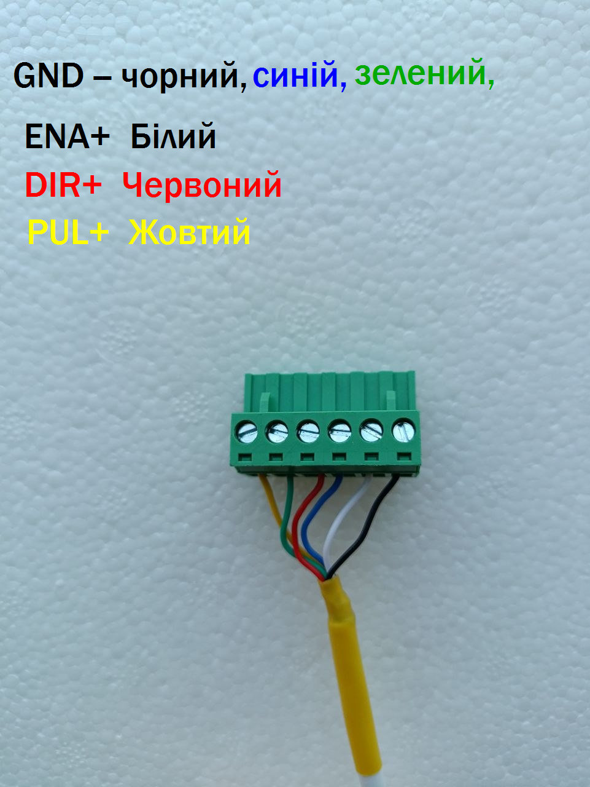
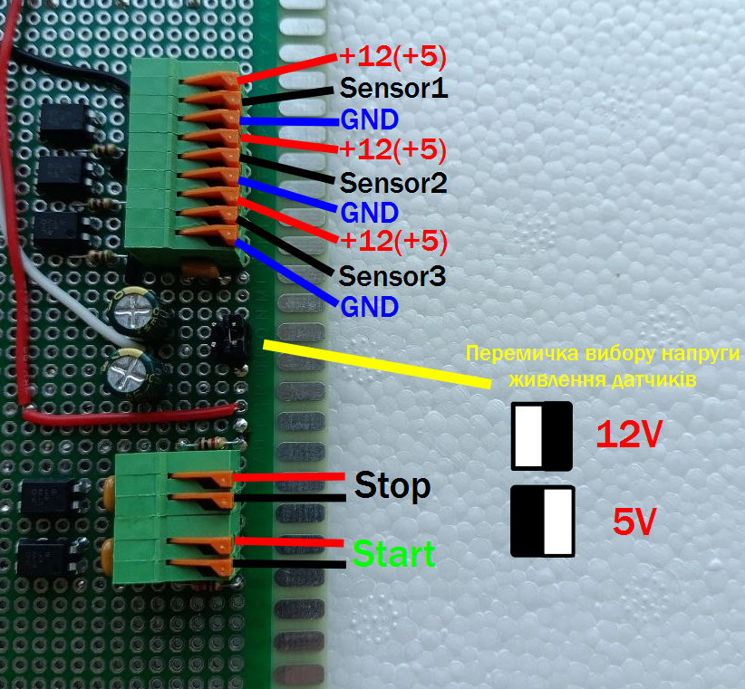
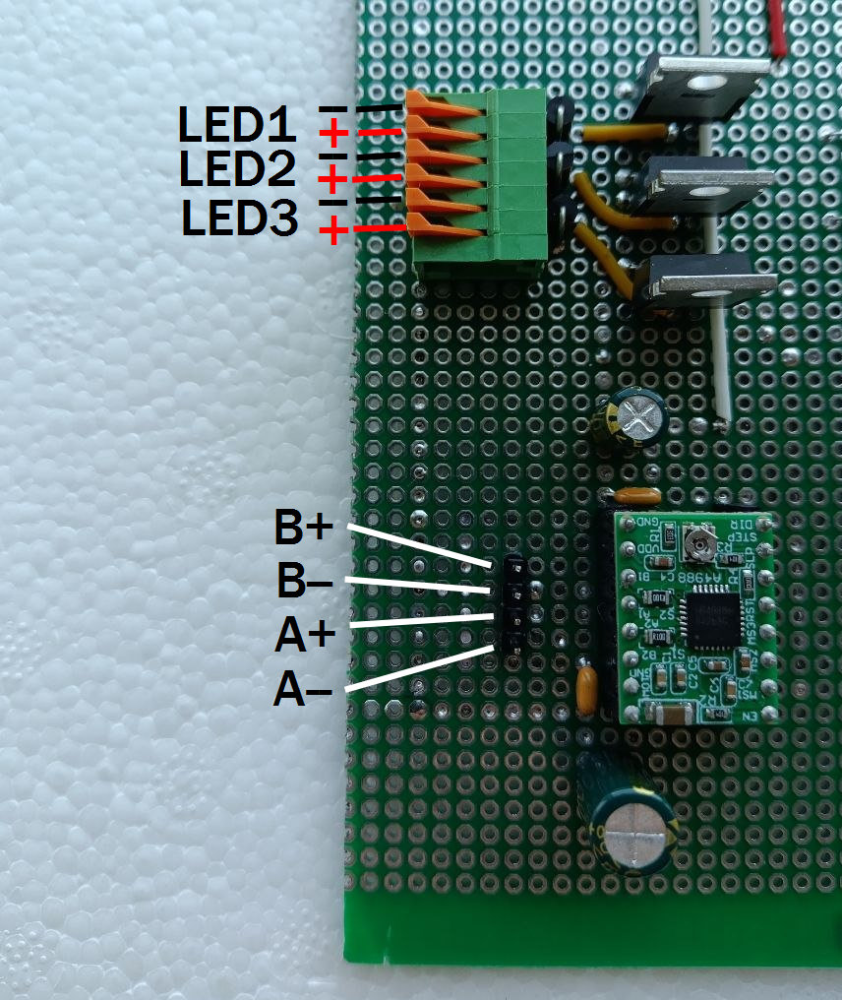
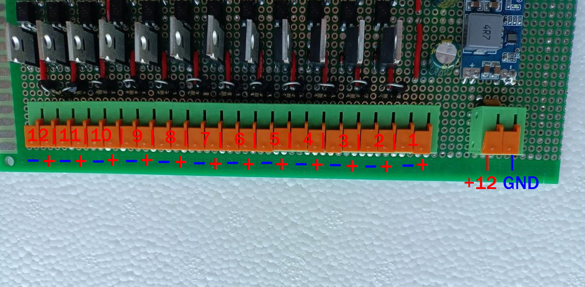
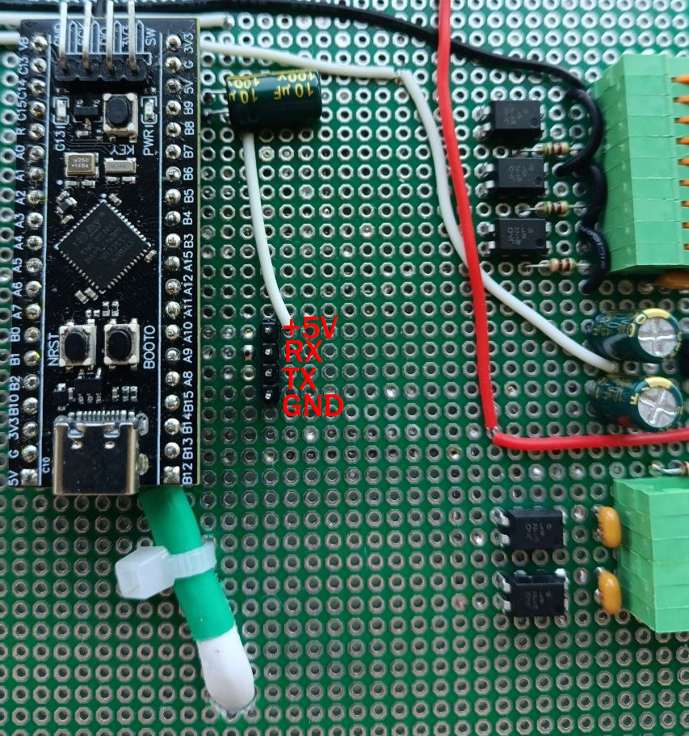

# Інструкція з підключення обладнання – Packing Machine Controller (STM32)

Цей документ містить схеми підключення основних вузлів станка до керуючого контролера. Усі зображення знаходяться в поточній папці `мануали`.

## 1. Загальний вигляд системи

*На фото зображено загальне розташування контролера, кнопок, датчиків, двигунів та виконавчих пристроїв.*

## 2. Підключення крокового двигуна 1 (конвеєр закривання) – `Motor1_pinout.jpg`

| Провід | Колір | Призначення | Підключення до драйвера |
|--------|-------|-------------|--------------------------|
| GND    | Чорний, синій, зелений | Спільний (земля) | GND драйвера |
| ENA+   | Білий  | Enable + (активний високий рівень) | +5V або пін контролера (якщо керується) |
| DIR+   | Червоний | Direction + | Пін STM32 (напрямок обертання) |
| PUL+   | Жовтий | Pulse + (кроковий сигнал) | Пін STM32 (вихід ШІМ/крок) |

> **Примітка:** Якщо драйвер потребує інверсних сигналів (ENA-, DIR-, PUL-), підключіть їх до GND контролера.

## 3. Підключення датчиків та кнопок – `Sensors_button_pinout.jpg`

Роз'єм має наступні контакти (зліва направо):

| Група | Контакт | Сигнал | Примітка |
|-------|---------|--------|----------|
| Датчик 1 | +12(+5) | Живлення датчика 1 | Вибирається перемичкою (12V або 5V) |
|         | Sensor1 | Вихід датчика 1 | Підключається до входу STM32 (PA2) |
|         | GND     | Земля датчика 1 | |
| Датчик 2 | +12(+5) | Живлення датчика 2 | |
|         | Sensor2 | Вихід датчика 2 | Підключається до входу STM32 (PA3) |
|         | GND     | Земля датчика 2 | |
| Датчик 3 | +12(+5) | Живлення датчика 3 | |
|         | Sensor3 | Вихід датчика 3 | Підключається до входу STM32 (PA4) з перериванням |
|         | GND     | Земля датчика 3 | |
| Кнопки  | Stop    | Нормально замкнена (NC) | Підключається до входу STM32 (PA1) з підтяжкою до + |
|         | Start   | Нормально розімкнена (NO) | Підключається до входу STM32 (PA0) з підтяжкою до GND |

**Перемичка вибору напруги:** Встановіть відповідну позицію (12V або 5V) згідно з технічними характеристиками ваших датчиків.

## 4. Підключення світлодіодів та другого двигуна – `Led_motor2_pinout.jpg`

| Контакт | Сигнал | Призначення | Підключення до STM32 |
|---------|--------|-------------|----------------------|
| LED1    | Виходи на світлодіоди (аноди) | Зелена лампа стану (LED1) | PA12 (через резистор 220 Ом до GND) |
| LED2    | | Червона/жовта лампа "немає пакетів" | PA13 (через резистор) |
| LED3    | | Резервний (не використовується) | - |
| B+      | Обмотка B+ крокового двигуна 2 | Підключається до драйвера MOTOR2 (B+) |
| B-      | Обмотка B- крокового двигуна 2 | Підключається до драйвера MOTOR2 (B-) |
| A+      | Обмотка A+ крокового двигуна 2 | Підключається до драйвера MOTOR2 (A+) |
| A-      | Обмотка A- крокового двигуна 2 | Підключається до драйвера MOTOR2 (A-) |

> **Увага:** Для MOTOR2 використовується окремий драйвер (аналогічно MOTOR1). Сигнали керування (PUL, DIR, ENA) підключаються до інших пінів STM32 (наприклад, PA8 – STEP, PA9 – DIR). Детальніше див. код у `pin_config.h`.

## 5. Підключення пневматичних виходів (OUTPUT1 – OUTPUT8) – `Output_pinout.jpg`

*На фото зображено клемник або роз'єм для підключення соленоїдних клапанів (пневморозподілювачів).*

**Відповідність виходів STM32 та PV:**

| Вихід STM32 | Позначення на платі | Призначення |
|-------------|---------------------|-------------|
| PB0 | OUTPUT1 (PV1) | Закривання кришки |
| PB1 | OUTPUT2 (PV2) | Планка зсуву спайок |
| PB2 | OUTPUT3 (PV3) | Штовхач у пакет |
| PB3 | OUTPUT4 (PV4) | Вертикаль платформи (вниз) |
| PB4 | OUTPUT5 (PV5) | Горизонталь платформи (вперед) |
| PB5 | OUTPUT6 (PV6) | Скидання пакета |
| PB6 | OUTPUT7 (PV7) | Вакуум |
| PB7 | OUTPUT8 (PV8) | Соленоїдний упор |

**Схема підключення одного клапана:**  
- Керуючий сигнал (наприклад, PB0) через оптоізолятор/транзисторний ключ керує обмоткою соленоїда.  
- Живлення клапанів – 24V DC (зовнішнє).  
- Зворотні діоди обов'язкові.

## 6. Підключення UART, живлення та додаткових ліній – `Uart_pinout.jpg`

Роз'єм містить:

| Контакт | Сигнал | Призначення |
|---------|--------|-------------|
| BOOT0   | Boot0 | Перемичка для завантаження (зазвичай GND) |
| BI2…BI10| Вільні входи/виходи | Не використовуються (резерв) |
| PWR     | Живлення контролера | +5V або +3.3V вхід |
| GND     | Земля | Спільна |
| RX      | UART RX | Підключення до TX зовнішнього пристрою (наприклад, ПК) |
| TX      | UART TX | Підключення до RX зовнішнього пристрою |
| +5V     | Вихід +5V | Для живлення невеликих модулів (до 100 мА) |
| 3.3V    | Вихід +3.3V | Для живлення датчиків/логіки |
| BAT     | Вхід резервного живлення | Для RTC (опційно) |
| A0…A15  | Аналогові входи | Резерв |
| A16…    | Цифрові входи/виходи | Резерв |

**Використання UART:**  
- Для налагодження підключіть USB-UART адаптер (TX → RX, RX → TX, GND → GND).  
- Швидкість 115200 бод, 8N1.

## 7. Рекомендації щодо живлення

- **Датчики** – використовуйте перемичку на роз'ємі `Sensors_button_pinout` для вибору 12V або 5V згідно з технічними даними вибраних датчиків, одночасно мож використовувати всі 3 датчики тіки з однією напругою живлення.  
- **Двигуни** – живляться від окремого джерела для Motor1 (наприклад, 24V/5A) через драйвери, Motor2 від напруги живлення плати.  
- **Пневмоклапани** – зовнішнє джерело 12V DC, загальна потужність залежить від кількості одночасно ввімкнених клапанів.  
- **Контролер STM32** – живиться через PWR (+5V).
